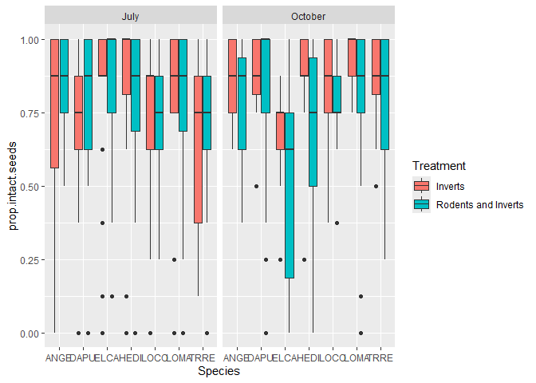
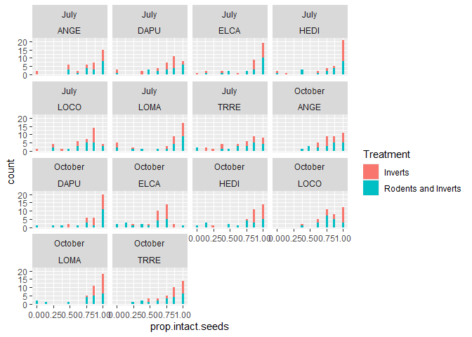
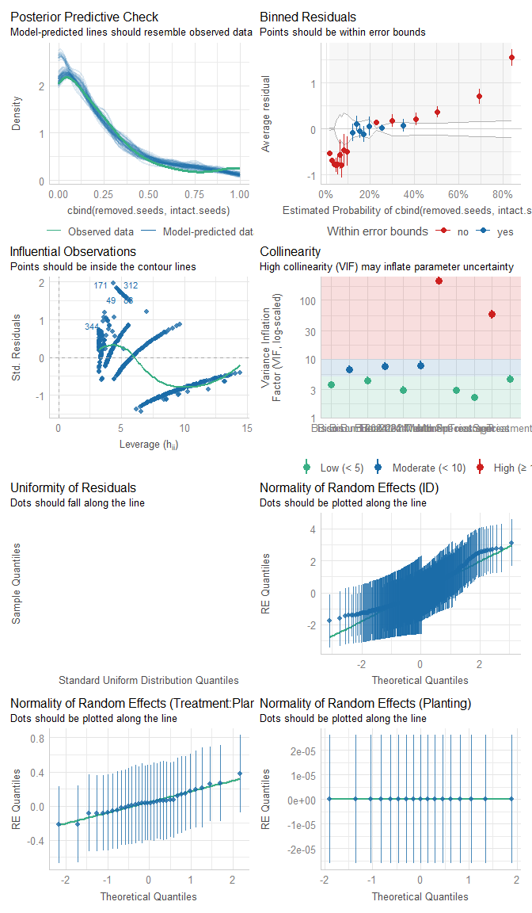
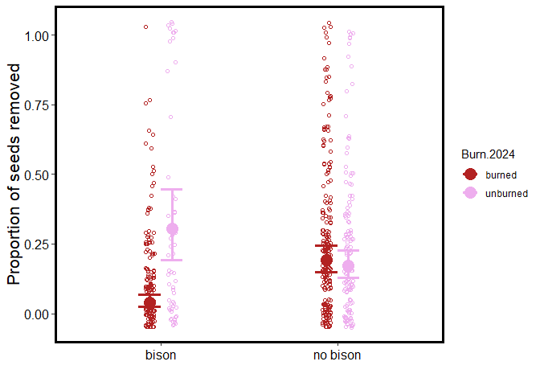
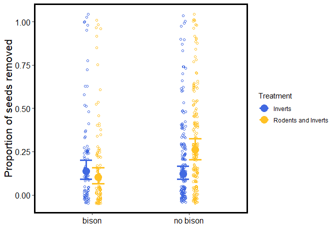
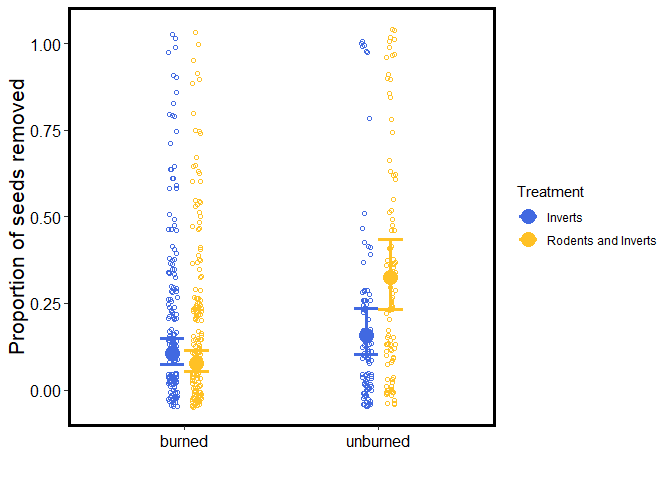
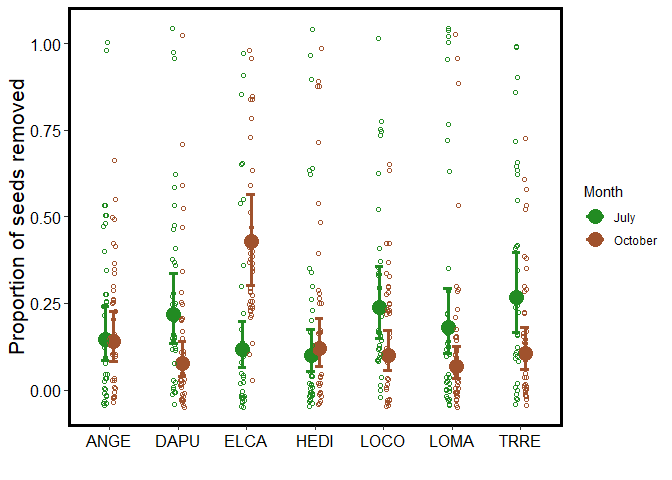
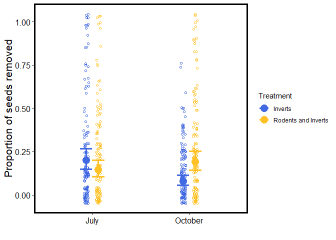

Seed removal responses to management
================
Pete Guiden
2024-12-05

This code provides a preliminary inspection of seed removal data
collected at 19 ReFUGE plots at Nachusa Grasslands in July and October
2024. 8 seeds of 7 species (list here) were placed cafeteria-style in
buckets that allowed access to either invertebrates alone, or
invertebrates and rodents. Plots vary in their managment history
(restoration age, bison presence, burn status for 2024).

Expect this code to be the main data presented in a manuscript examining
how management influences seed removal of native versus invasive plant
species.

## Inspecting the data

First step is to inspect the data before running any analyses.

There is one tricky things about the data that should be mentioned:
while we only put 8 seeds per species in each bucket, some buckets had
\>8 seeds of a species found. This is a low proportion (n = 14 cases out
of 531 species-bucket combinations, or 2.6%). My current resolution for
this was to assume that these cases had no seed removal of that species,
and to recalculate the total number of starting seeds to be whatever the
number of intact seeds recovered was. Should be a conservative way to
estimate seed removal without losing data, although I suspect running
models with and without these species/bucket combos will yield very
similar outcomes.

We can also check out some quick and dirty figures summarizing the data.
Looks like no issues with zero-inflation, etc., so a binomial glmer()
should work ok.

``` r
summary(seed.data)
```

    ##        ID          Planting            Month            Treatment        
    ##  Min.   :  1.0   Length:531         Length:531         Length:531        
    ##  1st Qu.:133.5   Class :character   Class :character   Class :character  
    ##  Median :266.0   Mode  :character   Mode  :character   Mode  :character  
    ##  Mean   :266.0                                                           
    ##  3rd Qu.:398.5                                                           
    ##  Max.   :531.0                                                           
    ##                                                                          
    ##    Species          Number.of.seeds.intact Number.of.damaged.seeds
    ##  Length:531         Min.   : 0.0           Min.   :1.00           
    ##  Class :character   1st Qu.: 5.0           1st Qu.:1.00           
    ##  Mode  :character   Median : 7.0           Median :1.00           
    ##                     Mean   : 6.2           Mean   :1.86           
    ##                     3rd Qu.: 8.0           3rd Qu.:2.00           
    ##                     Max.   :14.0           Max.   :8.00           
    ##                                            NA's   :424            
    ##  Evidence.of.damaged.seeds.    Notes            total.seeds     intact.seeds 
    ##  Length:531                 Length:531         Min.   : 8.00   Min.   : 0.0  
    ##  Class :character           Class :character   1st Qu.: 8.00   1st Qu.: 5.0  
    ##  Mode  :character           Mode  :character   Median : 8.00   Median : 7.0  
    ##                                                Mean   : 8.04   Mean   : 6.2  
    ##                                                3rd Qu.: 8.00   3rd Qu.: 8.0  
    ##                                                Max.   :14.00   Max.   :14.0  
    ##                                                                              
    ##  removed.seeds  prop.intact.seeds    Bison            Burn.2024        
    ##  Min.   :0.00   Min.   :0.000     Length:531         Length:531        
    ##  1st Qu.:0.00   1st Qu.:0.625     Class :character   Class :character  
    ##  Median :1.00   Median :0.875     Mode  :character   Mode  :character  
    ##  Mean   :1.84   Mean   :0.770                                          
    ##  3rd Qu.:3.00   3rd Qu.:1.000                                          
    ##  Max.   :8.00   Max.   :1.000                                          
    ##                                                                        
    ##  Year.restored       lat             lon            rest.age    
    ##  Min.   :1986   Min.   :41.87   Min.   :-89.37   Min.   :11.00  
    ##  1st Qu.:2002   1st Qu.:41.88   1st Qu.:-89.36   1st Qu.:15.00  
    ##  Median :2007   Median :41.89   Median :-89.33   Median :17.00  
    ##  Mean   :2005   Mean   :41.89   Mean   :-89.34   Mean   :19.25  
    ##  3rd Qu.:2009   3rd Qu.:41.90   3rd Qu.:-89.33   3rd Qu.:21.50  
    ##  Max.   :2013   Max.   :41.90   Max.   :-89.31   Max.   :37.50  
    ##  NA's   :56                                      NA's   :56

``` r
# How many buckets had more than 8 seeds recovered per species?
length(filter(seed.data, intact.seeds > 8)$ID)
```

    ## [1] 14

``` r
length(filter(seed.data, intact.seeds > 8)$ID)/length(seed.data$ID)
```

    ## [1] 0.02636535

``` r
ggplot(seed.data, aes(x = Species, fill = Treatment, y = prop.intact.seeds))+
  facet_wrap(~Month)+
  geom_boxplot()
```

<!-- -->

``` r
ggplot(seed.data, aes(x = prop.intact.seeds, fill = Treatment))+
  facet_wrap(Month~Species)+
  geom_histogram()
```

    ## `stat_bin()` using `bins = 30`. Pick better value with `binwidth`.

<!-- -->

## Model construction

After inspecing the data, we can run some models.

Before modeling for real, I like to run an lmer() strictly to check the
denominator DF’s to make sure the model is accurately interpreting our
experimental design (following the advice of Arnqvist 2020 TREE). For
example, any management action should be replicated at the planting
level, not the bucket level (so it should have ~18 DDFs instead of ~500
DDFs). After some tinkering, I ended up with a random intercept term
nesting Treatment inside Planting (i.e., (1\|Planting/Treatment)), which
makes sense. I also add a random intercept for the unit of replication
(i.e., species-planting-month combination, which matches the ID column;
(1\|ID)), which helps account for overdispersion in binomial/Poisson
models.

It bears repeating but *we don’t care about the coefficients or P-values
here*; this exercise is simply done to eyeball the denominator degrees
of freedom to increase our confidence about random effects structures.

``` r
# Check with regular lmer: Treatment is nested within Planting!
seed.model.check = lmer(data = seed.data,
                   prop.intact.seeds~Treatment*Species+
                     Bison*Burn.2024+(1|Planting/Treatment))
```

    ## boundary (singular) fit: see help('isSingular')

``` r
Anova(seed.model.check, test = 'F')
```

    ## Analysis of Deviance Table (Type II Wald F tests with Kenward-Roger df)
    ## 
    ## Response: prop.intact.seeds
    ##                        F Df Df.res  Pr(>F)  
    ## Treatment         2.1058  1  18.00 0.16395  
    ## Species           1.6228  6 481.04 0.13880  
    ## Bison             2.6129  1  15.03 0.12678  
    ## Burn.2024         0.8001  1  15.03 0.38517  
    ## Treatment:Species 1.1843  6 481.04 0.31324  
    ## Bison:Burn.2024   5.9759  1  15.08 0.02725 *
    ## ---
    ## Signif. codes:  0 '***' 0.001 '**' 0.01 '*' 0.05 '.' 0.1 ' ' 1

After the random effects are structure properly, we can get into the
real modeling. Since we’re interested in knowing the proportion of seeds
removed, we’ll use a binomial GLMM withn the cbind() function. Note that
the order of terms in cbind() matters; here we’ll go cbind(removed,
intact) to express results as the **proportion of seeds removed**. We’ll
use this convention throughout.

As far as structuring the model, we have some decisions to make. We have
six key variables we are hypothesizing to be important: age (continuous,
no remnants), bison (present/absent), fire (burned/unburned), treatment
(inverts, rodents+inverts), month (Jul, Oct), and species (7 levels).
**We will keep all of these main effects in the model**. However, we
also have reason to think that interactions might be important (e.g.,
bison might affect rodents and inverts differently). We’ll use model
selection (MuMIn package) to tell us which interactions are the most
important, starting with a global model with….6 main effects and 15(!!!)
interactive effects. Unsurprisingly, the global model has two key
weaknesses: 1) model diagnostics suggest problems (huge VIF, etc.) and
2) model convergence requires a lot of computer power (~90 minutes on my
machine). Code for this model selection process is hidden in a code
chunk below, but is commented out because it takes \>3 hours to perform.
We decided *a priori* in a Dec 5 meeting to retain the simplest top
model. R returned 4 models with \<2 AICc, and no clear winner.
Therefore, we’ll keep the simplest of the “best” 4 models; it has the
added bonus of slightly nicer model diagnostics, too.

    ## boundary (singular) fit: see help('isSingular')

<!-- -->

    ## Generalized linear mixed model fit by maximum likelihood (Laplace
    ##   Approximation) [glmerMod]
    ##  Family: binomial  ( logit )
    ## Formula: cbind(removed.seeds, intact.seeds) ~ Bison + Burn.2024 + Month +  
    ##     Species + Treatment + rest.age + Bison * Burn.2024 + Bison *  
    ##     Treatment + Burn.2024 * Treatment + Month * Species + Month *  
    ##     Treatment + (1 | Planting/Treatment) + (1 | ID)
    ##    Data: seed.data
    ## Control: glmerControl(optimizer = "bobyqa", optCtrl = list(maxfun = 2e+05))
    ## 
    ##      AIC      BIC   logLik deviance df.resid 
    ##   1649.2   1753.3   -799.6   1599.2      450 
    ## 
    ## Scaled residuals: 
    ##      Min       1Q   Median       3Q      Max 
    ## -1.04215 -0.54106 -0.08713  0.34494  1.47554 
    ## 
    ## Random effects:
    ##  Groups             Name        Variance  Std.Dev. 
    ##  ID                 (Intercept) 1.823e+00 1.350e+00
    ##  Treatment:Planting (Intercept) 6.781e-02 2.604e-01
    ##  Planting           (Intercept) 1.756e-10 1.325e-05
    ## Number of obs: 475, groups:  ID, 475; Treatment:Planting, 34; Planting, 17
    ## 
    ## Fixed effects:
    ##                                                Estimate Std. Error z value
    ## (Intercept)                                    -3.53755    0.72723  -4.864
    ## Bisonno bison                                   1.11751    0.38141   2.930
    ## Burn.2024unburned                               1.69899    0.51830   3.278
    ## MonthOctober                                   -0.74232    0.45884  -1.618
    ## SpeciesDAPU                                     0.49356    0.42312   1.166
    ## SpeciesELCA                                    -0.26893    0.44080  -0.610
    ## SpeciesHEDI                                    -0.45054    0.44875  -1.004
    ## SpeciesLOCO                                     0.60618    0.41955   1.445
    ## SpeciesLOMA                                     0.25782    0.43429   0.594
    ## SpeciesTRRE                                     0.75007    0.42484   1.766
    ## TreatmentRodents and Inverts                   -1.64001    0.39953  -4.105
    ## rest.age                                        0.06100    0.02148   2.839
    ## Bisonno bison:Burn.2024unburned                -2.47840    0.52091  -4.758
    ## Bisonno bison:TreatmentRodents and Inverts      1.23682    0.40449   3.058
    ## Burn.2024unburned:TreatmentRodents and Inverts  1.28560    0.38241   3.362
    ## MonthOctober:SpeciesDAPU                       -1.16743    0.61653  -1.894
    ## MonthOctober:SpeciesELCA                        1.80101    0.60080   2.998
    ## MonthOctober:SpeciesHEDI                        0.28869    0.62365   0.463
    ## MonthOctober:SpeciesLOCO                       -0.99394    0.60255  -1.650
    ## MonthOctober:SpeciesLOMA                       -1.07051    0.62875  -1.703
    ## MonthOctober:SpeciesTRRE                       -1.07118    0.60734  -1.764
    ## MonthOctober:TreatmentRodents and Inverts       1.37229    0.33054   4.152
    ##                                                Pr(>|z|)    
    ## (Intercept)                                    1.15e-06 ***
    ## Bisonno bison                                  0.003390 ** 
    ## Burn.2024unburned                              0.001046 ** 
    ## MonthOctober                                   0.105702    
    ## SpeciesDAPU                                    0.243417    
    ## SpeciesELCA                                    0.541800    
    ## SpeciesHEDI                                    0.315376    
    ## SpeciesLOCO                                    0.148506    
    ## SpeciesLOMA                                    0.552742    
    ## SpeciesTRRE                                    0.077471 .  
    ## TreatmentRodents and Inverts                   4.05e-05 ***
    ## rest.age                                       0.004520 ** 
    ## Bisonno bison:Burn.2024unburned                1.96e-06 ***
    ## Bisonno bison:TreatmentRodents and Inverts     0.002230 ** 
    ## Burn.2024unburned:TreatmentRodents and Inverts 0.000774 ***
    ## MonthOctober:SpeciesDAPU                       0.058283 .  
    ## MonthOctober:SpeciesELCA                       0.002720 ** 
    ## MonthOctober:SpeciesHEDI                       0.643433    
    ## MonthOctober:SpeciesLOCO                       0.099030 .  
    ## MonthOctober:SpeciesLOMA                       0.088644 .  
    ## MonthOctober:SpeciesTRRE                       0.077778 .  
    ## MonthOctober:TreatmentRodents and Inverts      3.30e-05 ***
    ## ---
    ## Signif. codes:  0 '***' 0.001 '**' 0.01 '*' 0.05 '.' 0.1 ' ' 1

    ## 
    ## Correlation matrix not shown by default, as p = 22 > 12.
    ## Use print(x, correlation=TRUE)  or
    ##     vcov(x)        if you need it

    ## optimizer (bobyqa) convergence code: 0 (OK)
    ## boundary (singular) fit: see help('isSingular')

    ## Analysis of Deviance Table (Type II Wald chisquare tests)
    ## 
    ## Response: cbind(removed.seeds, intact.seeds)
    ##                       Chisq Df Pr(>Chisq)    
    ## Bison                5.8998  1  0.0151422 *  
    ## Burn.2024            2.1022  1  0.1470874    
    ## Month                3.7580  1  0.0525560 .  
    ## Species             15.7275  6  0.0152937 *  
    ## Treatment            4.5364  1  0.0331816 *  
    ## rest.age             8.0621  1  0.0045202 ** 
    ## Bison:Burn.2024     22.6365  1  1.957e-06 ***
    ## Bison:Treatment      9.3498  1  0.0022301 ** 
    ## Burn.2024:Treatment 11.3021  1  0.0007742 ***
    ## Month:Species       38.4648  6  9.112e-07 ***
    ## Month:Treatment     17.2366  1  3.300e-05 ***
    ## ---
    ## Signif. codes:  0 '***' 0.001 '**' 0.01 '*' 0.05 '.' 0.1 ' ' 1

## Model output

Ok, lots to unpack here! We’ll use the emmeans package to visualize key
interactive effects, including post-hoc tests to determine significance
between categorical groups. There are five significant interactions to
examine:

### 1) Bison x Fire

Averaged across all treatments, plantings that both were burned and
allowed bison access had the lowest amount of seed removal. Some
interesting tidbits: -Looking only at plots with bison access, seed
removal was **6 times lower** in burned vs unburned plots -Looking only
at unburned plots, there’s no difference in seed removal between bison
absent and bison present plots. This suggests that you really might want
both management practices if minimizing seed removal is important.

    ## $emmeans
    ##  Bison    Burn.2024   prob     SE  df asymp.LCL asymp.UCL
    ##  bison    burned    0.0403 0.0110 Inf    0.0234    0.0684
    ##  no bison burned    0.1923 0.0245 Inf    0.1488    0.2448
    ##  bison    unburned  0.3037 0.0664 Inf    0.1908    0.4466
    ##  no bison unburned  0.1719 0.0256 Inf    0.1274    0.2280
    ## 
    ## Results are averaged over the levels of: Month, Species, Treatment 
    ## Confidence level used: 0.95 
    ## Intervals are back-transformed from the logit scale 
    ## 
    ## $contrasts
    ##  contrast                            odds.ratio     SE  df null z.ratio p.value
    ##  bison burned / no bison burned          0.1762 0.0586 Inf    1  -5.220  <.0001
    ##  bison burned / bison unburned           0.0962 0.0465 Inf    1  -4.839  <.0001
    ##  bison burned / no bison unburned        0.2020 0.0719 Inf    1  -4.493  <.0001
    ##  no bison burned / bison unburned        0.5456 0.1851 Inf    1  -1.786  0.2800
    ##  no bison burned / no bison unburned     1.1464 0.2646 Inf    1   0.592  0.9345
    ##  bison unburned / no bison unburned      2.1011 0.7127 Inf    1   2.189  0.1263
    ## 
    ## Results are averaged over the levels of: Month, Species, Treatment 
    ## P value adjustment: tukey method for comparing a family of 4 estimates 
    ## Tests are performed on the log odds ratio scale

    ## Warning: Using `size` aesthetic for lines was deprecated in ggplot2 3.4.0.
    ## ℹ Please use `linewidth` instead.
    ## This warning is displayed once every 8 hours.
    ## Call `lifecycle::last_lifecycle_warnings()` to see where this warning was
    ## generated.

<!-- -->

### 2) Bison x Guild

Now we can start looking at how management affects different granivore
guilds. First up, a significant bison x guild interaction. Key takehome
here is that in the Inverts only depots, there is no difference in seed
removal between plots with and without bison. However, where rodents and
inverts both are able to access seeds, we see 2.5 times more seed
removal in plots without bison compared to plots with bison. I interpret
this as perhaps evidence that there is a behavioral change in rodents
where bison are present (Guiden et al. 2022 Ecology).

``` r
emmeans(small.model, pairwise~Bison*Treatment, type = 'response', adjust = 'Tukey')
```

    ## $emmeans
    ##  Bison    Treatment            prob     SE  df asymp.LCL asymp.UCL
    ##  bison    Inverts             0.136 0.0283 Inf    0.0898     0.202
    ##  no bison Inverts             0.123 0.0190 Inf    0.0901     0.165
    ##  bison    Rodents and Inverts 0.104 0.0230 Inf    0.0665     0.158
    ##  no bison Rodents and Inverts 0.261 0.0310 Inf    0.2048     0.326
    ## 
    ## Results are averaged over the levels of: Burn.2024, Month, Species 
    ## Confidence level used: 0.95 
    ## Intervals are back-transformed from the logit scale 
    ## 
    ## $contrasts
    ##  contrast                                                 odds.ratio     SE  df
    ##  bison Inverts / no bison Inverts                              1.129 0.3307 Inf
    ##  bison Inverts / bison Rodents and Inverts                     1.365 0.4573 Inf
    ##  bison Inverts / no bison Rodents and Inverts                  0.448 0.1294 Inf
    ##  no bison Inverts / bison Rodents and Inverts                  1.209 0.3625 Inf
    ##  no bison Inverts / no bison Rodents and Inverts               0.396 0.0913 Inf
    ##  bison Rodents and Inverts / no bison Rodents and Inverts      0.328 0.0962 Inf
    ##  null z.ratio p.value
    ##     1   0.416  0.9758
    ##     1   0.929  0.7896
    ##     1  -2.782  0.0277
    ##     1   0.631  0.9220
    ##     1  -4.017  0.0003
    ##     1  -3.801  0.0008
    ## 
    ## Results are averaged over the levels of: Burn.2024, Month, Species 
    ## P value adjustment: tukey method for comparing a family of 4 estimates 
    ## Tests are performed on the log odds ratio scale

``` r
bison.treat.emm <- summary(emmeans(small.model, ~Bison*Treatment, type = 'response'))

ggplot(bison.treat.emm, aes(x = Bison, y = prob, color = Treatment))+
  geom_point(position = position_dodge(width = 0.25), size = 5)+
  geom_point(data = seed.data, aes(y = 1-prop.intact.seeds), shape = 1,
             position = position_jitterdodge(dodge.width = 0.25,
                                             jitter.height = 0.05,
                                             jitter.width = 0.05))+
  geom_errorbar(aes(ymin = asymp.LCL, ymax = asymp.UCL),
                size = 1.25, width = 0.25,
                position = position_dodge(width = 0.25))+
  labs(x = '', y = 'Proportion of seeds removed')+
  scale_y_continuous(limits = c(-0.05, 1.05))+
  scale_color_manual(values = c('royalblue', 'goldenrod1'))+
  pal.theme
```

<!-- -->

### 3) Fire x Guild

Burning seems to increase seed removal, but only by rodents. There is no
difference between Invert-only depots in burned versus unburned
plantings. On the other hand, depots allowing inverts and rodents
experienced greater seed removal in unburned areas vs burned areas
(thatch = vole city?). There’s also a compelling increase in seed
removal between unburned plantings allowing rodents compared to unburned
plantings with only inverts.

``` r
emmeans(small.model, pairwise~Burn.2024*Treatment, type = 'response', adjust = 'Tukey')
```

    ## $emmeans
    ##  Burn.2024 Treatment             prob     SE  df asymp.LCL asymp.UCL
    ##  burned    Inverts             0.1057 0.0188 Inf    0.0741     0.149
    ##  unburned  Inverts             0.1576 0.0335 Inf    0.1025     0.235
    ##  burned    Rodents and Inverts 0.0779 0.0151 Inf    0.0531     0.113
    ##  unburned  Rodents and Inverts 0.3261 0.0519 Inf    0.2335     0.435
    ## 
    ## Results are averaged over the levels of: Bison, Month, Species 
    ## Confidence level used: 0.95 
    ## Intervals are back-transformed from the logit scale 
    ## 
    ## $contrasts
    ##  contrast                                                  odds.ratio     SE
    ##  burned Inverts / unburned Inverts                              0.631 0.2132
    ##  burned Inverts / burned Rodents and Inverts                    1.399 0.3559
    ##  burned Inverts / unburned Rodents and Inverts                  0.244 0.0815
    ##  unburned Inverts / burned Rodents and Inverts                  2.215 0.7794
    ##  unburned Inverts / unburned Rodents and Inverts                0.387 0.1172
    ##  burned Rodents and Inverts / unburned Rodents and Inverts      0.175 0.0581
    ##   df null z.ratio p.value
    ##  Inf    1  -1.362  0.5235
    ##  Inf    1   1.318  0.5512
    ##  Inf    1  -4.222  0.0001
    ##  Inf    1   2.260  0.1075
    ##  Inf    1  -3.134  0.0093
    ##  Inf    1  -5.241  <.0001
    ## 
    ## Results are averaged over the levels of: Bison, Month, Species 
    ## P value adjustment: tukey method for comparing a family of 4 estimates 
    ## Tests are performed on the log odds ratio scale

``` r
fire.treat.emm <- summary(emmeans(small.model, ~Burn.2024*Treatment, type = 'response'))

ggplot(fire.treat.emm, aes(x = Burn.2024, y = prob, color = Treatment))+
  geom_point(position = position_dodge(width = 0.25), size = 5)+
  geom_point(data = seed.data, aes(y = 1-prop.intact.seeds), shape = 1,
             position = position_jitterdodge(dodge.width = 0.25,
                                             jitter.height = 0.05,
                                             jitter.width = 0.05))+
  geom_errorbar(aes(ymin = asymp.LCL, ymax = asymp.UCL),
                size = 1.25, width = 0.25,
                position = position_dodge(width = 0.25))+
  labs(x = '', y = 'Proportion of seeds removed')+
  scale_y_continuous(limits = c(-0.05, 1.05))+
  scale_color_manual(values = c('royalblue', 'goldenrod1'))+
  pal.theme
```

<!-- -->

### 4) Month x Seed species

This is an interesting interaction that I’m still puzzling on at the
moment. The key pattern here is that Elymus has a big spike in seed
removal in the fall, where as Dalea is removed quite a bit less in the
fall. I want to get into the trapping data to confirm my hunch, but I
wonder if this might represent switches in preference between rodents or
inverts active in these seasons. Important to remember that the weather
was quite cold in the fall session– several nights were freezing (we
could confirm this with the Nachusa weather station data).

``` r
emmeans(small.model, pairwise~Month*Species, type = 'response', adjust = 'Tukey')
```

    ## $emmeans
    ##  Month   Species   prob     SE  df asymp.LCL asymp.UCL
    ##  July    ANGE    0.1463 0.0394 Inf    0.0845     0.241
    ##  October ANGE    0.1394 0.0368 Inf    0.0816     0.228
    ##  July    DAPU    0.2191 0.0511 Inf    0.1352     0.335
    ##  October DAPU    0.0763 0.0241 Inf    0.0405     0.139
    ##  July    ELCA    0.1158 0.0336 Inf    0.0644     0.199
    ##  October ELCA    0.4284 0.0691 Inf    0.3013     0.566
    ##  July    HEDI    0.0984 0.0302 Inf    0.0531     0.175
    ##  October HEDI    0.1211 0.0344 Inf    0.0681     0.206
    ##  July    LOCO    0.2390 0.0533 Inf    0.1503     0.358
    ##  October LOCO    0.0990 0.0287 Inf    0.0553     0.171
    ##  July    LOMA    0.1815 0.0471 Inf    0.1064     0.292
    ##  October LOMA    0.0670 0.0220 Inf    0.0348     0.125
    ##  July    TRRE    0.2662 0.0591 Inf    0.1670     0.396
    ##  October TRRE    0.1051 0.0304 Inf    0.0587     0.181
    ## 
    ## Results are averaged over the levels of: Bison, Burn.2024, Treatment 
    ## Confidence level used: 0.95 
    ## Intervals are back-transformed from the logit scale 
    ## 
    ## $contrasts
    ##  contrast                    odds.ratio     SE  df null z.ratio p.value
    ##  July ANGE / October ANGE         1.058 0.4524 Inf    1   0.131  1.0000
    ##  July ANGE / July DAPU            0.610 0.2583 Inf    1  -1.166  0.9968
    ##  July ANGE / October DAPU         2.075 0.9372 Inf    1   1.616  0.9423
    ##  July ANGE / July ELCA            1.309 0.5768 Inf    1   0.610  1.0000
    ##  July ANGE / October ELCA         0.229 0.0946 Inf    1  -3.565  0.0249
    ##  July ANGE / July HEDI            1.569 0.7042 Inf    1   1.004  0.9993
    ##  July ANGE / October HEDI         1.244 0.5458 Inf    1   0.497  1.0000
    ##  July ANGE / July LOCO            0.545 0.2288 Inf    1  -1.445  0.9766
    ##  July ANGE / October LOCO         1.559 0.6826 Inf    1   1.014  0.9992
    ##  July ANGE / July LOMA            0.773 0.3356 Inf    1  -0.594  1.0000
    ##  July ANGE / October LOMA         2.384 1.0951 Inf    1   1.892  0.8316
    ##  July ANGE / July TRRE            0.472 0.2007 Inf    1  -1.766  0.8915
    ##  July ANGE / October TRRE         1.458 0.6401 Inf    1   0.860  0.9999
    ##  October ANGE / July DAPU         0.577 0.2409 Inf    1  -1.317  0.9897
    ##  October ANGE / October DAPU      1.962 0.8772 Inf    1   1.507  0.9667
    ##  October ANGE / July ELCA         1.237 0.5401 Inf    1   0.487  1.0000
    ##  October ANGE / October ELCA      0.216 0.0880 Inf    1  -3.761  0.0124
    ##  October ANGE / July HEDI         1.483 0.6599 Inf    1   0.886  0.9998
    ##  October ANGE / October HEDI      1.176 0.5099 Inf    1   0.373  1.0000
    ##  October ANGE / July LOCO         0.516 0.2133 Inf    1  -1.601  0.9463
    ##  October ANGE / October LOCO      1.474 0.6371 Inf    1   0.897  0.9998
    ##  October ANGE / July LOMA         0.731 0.3137 Inf    1  -0.731  1.0000
    ##  October ANGE / October LOMA      2.254 1.0245 Inf    1   1.788  0.8820
    ##  October ANGE / July TRRE         0.447 0.1872 Inf    1  -1.923  0.8143
    ##  October ANGE / October TRRE      1.379 0.5978 Inf    1   0.741  1.0000
    ##  July DAPU / October DAPU         3.399 1.5066 Inf    1   2.761  0.2446
    ##  July DAPU / July ELCA            2.144 0.9269 Inf    1   1.763  0.8925
    ##  July DAPU / October ELCA         0.374 0.1503 Inf    1  -2.448  0.4453
    ##  July DAPU / July HEDI            2.571 1.1339 Inf    1   2.140  0.6731
    ##  July DAPU / October HEDI         2.037 0.8750 Inf    1   1.657  0.9306
    ##  July DAPU / July LOCO            0.893 0.3647 Inf    1  -0.276  1.0000
    ##  July DAPU / October LOCO         2.554 1.0929 Inf    1   2.190  0.6366
    ##  July DAPU / July LOMA            1.266 0.5378 Inf    1   0.555  1.0000
    ##  July DAPU / October LOMA         3.906 1.7614 Inf    1   3.021  0.1306
    ##  July DAPU / July TRRE            0.774 0.3203 Inf    1  -0.620  1.0000
    ##  July DAPU / October TRRE         2.389 1.0260 Inf    1   2.028  0.7503
    ##  October DAPU / July ELCA         0.631 0.2896 Inf    1  -1.004  0.9993
    ##  October DAPU / October ELCA      0.110 0.0479 Inf    1  -5.071  <.0001
    ##  October DAPU / July HEDI         0.756 0.3528 Inf    1  -0.599  1.0000
    ##  October DAPU / October HEDI      0.599 0.2742 Inf    1  -1.119  0.9979
    ##  October DAPU / July LOCO         0.263 0.1156 Inf    1  -3.038  0.1249
    ##  October DAPU / October LOCO      0.751 0.3429 Inf    1  -0.627  1.0000
    ##  October DAPU / July LOMA         0.372 0.1688 Inf    1  -2.180  0.6447
    ##  October DAPU / October LOMA      1.149 0.5475 Inf    1   0.291  1.0000
    ##  October DAPU / July TRRE         0.228 0.1012 Inf    1  -3.328  0.0541
    ##  October DAPU / October TRRE      0.703 0.3214 Inf    1  -0.771  1.0000
    ##  July ELCA / October ELCA         0.175 0.0741 Inf    1  -4.115  0.0031
    ##  July ELCA / July HEDI            1.199 0.5469 Inf    1   0.398  1.0000
    ##  July ELCA / October HEDI         0.950 0.4250 Inf    1  -0.114  1.0000
    ##  July ELCA / July LOCO            0.417 0.1788 Inf    1  -2.040  0.7423
    ##  July ELCA / October LOCO         1.191 0.5318 Inf    1   0.392  1.0000
    ##  July ELCA / July LOMA            0.591 0.2614 Inf    1  -1.190  0.9961
    ##  July ELCA / October LOMA         1.822 0.8507 Inf    1   1.285  0.9918
    ##  July ELCA / July TRRE            0.361 0.1567 Inf    1  -2.348  0.5189
    ##  July ELCA / October TRRE         1.114 0.4984 Inf    1   0.242  1.0000
    ##  October ELCA / July HEDI         6.865 2.9747 Inf    1   4.446  0.0007
    ##  October ELCA / October HEDI      5.441 2.2868 Inf    1   4.030  0.0044
    ##  October ELCA / July LOCO         2.386 0.9482 Inf    1   2.189  0.6379
    ##  October ELCA / October LOCO      6.820 2.8539 Inf    1   4.588  0.0004
    ##  October ELCA / July LOMA         3.381 1.4050 Inf    1   2.931  0.1643
    ##  October ELCA / October LOMA     10.431 4.6189 Inf    1   5.295  <.0001
    ##  October ELCA / July TRRE         2.066 0.8343 Inf    1   1.798  0.8777
    ##  October ELCA / October TRRE      6.380 2.6815 Inf    1   4.409  0.0009
    ##  July HEDI / October HEDI         0.793 0.3607 Inf    1  -0.511  1.0000
    ##  July HEDI / July LOCO            0.348 0.1522 Inf    1  -2.414  0.4698
    ##  July HEDI / October LOCO         0.993 0.4513 Inf    1  -0.015  1.0000
    ##  July HEDI / July LOMA            0.492 0.2219 Inf    1  -1.572  0.9534
    ##  July HEDI / October LOMA         1.519 0.7204 Inf    1   0.882  0.9998
    ##  July HEDI / July TRRE            0.301 0.1332 Inf    1  -2.712  0.2714
    ##  July HEDI / October TRRE         0.929 0.4229 Inf    1  -0.161  1.0000
    ##  October HEDI / July LOCO         0.439 0.1868 Inf    1  -1.935  0.8073
    ##  October HEDI / October LOCO      1.253 0.5558 Inf    1   0.509  1.0000
    ##  October HEDI / July LOMA         0.621 0.2738 Inf    1  -1.080  0.9985
    ##  October HEDI / October LOMA      1.917 0.8905 Inf    1   1.401  0.9820
    ##  October HEDI / July TRRE         0.380 0.1638 Inf    1  -2.245  0.5963
    ##  October HEDI / October TRRE      1.173 0.5213 Inf    1   0.358  1.0000
    ##  July LOCO / October LOCO         2.858 1.2128 Inf    1   2.475  0.4258
    ##  July LOCO / July LOMA            1.417 0.5968 Inf    1   0.827  0.9999
    ##  July LOCO / October LOMA         4.371 1.9569 Inf    1   3.295  0.0600
    ##  July LOCO / July TRRE            0.866 0.3553 Inf    1  -0.351  1.0000
    ##  July LOCO / October TRRE         2.674 1.1388 Inf    1   2.309  0.5480
    ##  October LOCO / July LOMA         0.496 0.2179 Inf    1  -1.597  0.9475
    ##  October LOCO / October LOMA      1.529 0.7087 Inf    1   0.917  0.9997
    ##  October LOCO / July TRRE         0.303 0.1302 Inf    1  -2.778  0.2356
    ##  October LOCO / October TRRE      0.936 0.4147 Inf    1  -0.150  1.0000
    ##  July LOMA / October LOMA         3.085 1.4226 Inf    1   2.444  0.4481
    ##  July LOMA / July TRRE            0.611 0.2607 Inf    1  -1.154  0.9971
    ##  July LOMA / October TRRE         1.887 0.8315 Inf    1   1.441  0.9770
    ##  October LOMA / July TRRE         0.198 0.0897 Inf    1  -3.577  0.0240
    ##  October LOMA / October TRRE      0.612 0.2841 Inf    1  -1.058  0.9988
    ##  July TRRE / October TRRE         3.087 1.3312 Inf    1   2.615  0.3307
    ## 
    ## Results are averaged over the levels of: Bison, Burn.2024, Treatment 
    ## P value adjustment: tukey method for comparing a family of 14 estimates 
    ## Tests are performed on the log odds ratio scale

``` r
month.species.emm <- summary(emmeans(small.model, ~Month*Species, type = 'response'))

ggplot(month.species.emm, aes(x = Species, y = prob, color = Month))+
  geom_point(position = position_dodge(width = 0.25), size = 5)+
  geom_point(data = seed.data, aes(y = 1-prop.intact.seeds), shape = 1,
             position = position_jitterdodge(dodge.width = 0.25,
                                             jitter.height = 0.05,
                                             jitter.width = 0.05))+
  geom_errorbar(aes(ymin = asymp.LCL, ymax = asymp.UCL),
                size = 1.25, width = 0.25,
                position = position_dodge(width = 0.25))+
  labs(x = '', y = 'Proportion of seeds removed')+
  scale_y_continuous(limits = c(-0.05, 1.05))+
  scale_color_manual(values = c('forestgreen', 'sienna'))+
  pal.theme
```

<!-- -->

### 5) Month x Guild

And finally, we see some evidence that the magnitude of seed removal by
the two consumer guilds changed over time, but in different directions.
In July, seed removal was equally strong between the two guilds. In
October, more than twice as much seed removal was observed in depots
allowing both rodents and inverts, compared to depots with inverts
alone. Again, this makes complete sense given the rather cold weather we
experienced in mid-October.

``` r
emmeans(small.model, pairwise~Month*Treatment, type = 'response', adjust = 'Tukey')
```

    ## $emmeans
    ##  Month   Treatment             prob     SE  df asymp.LCL asymp.UCL
    ##  July    Inverts             0.2016 0.0300 Inf    0.1491     0.267
    ##  October Inverts             0.0805 0.0148 Inf    0.0559     0.115
    ##  July    Rodents and Inverts 0.1474 0.0241 Inf    0.1061     0.201
    ##  October Rodents and Inverts 0.1913 0.0284 Inf    0.1417     0.253
    ## 
    ## Results are averaged over the levels of: Bison, Burn.2024, Species 
    ## Confidence level used: 0.95 
    ## Intervals are back-transformed from the logit scale 
    ## 
    ## $contrasts
    ##  contrast                                               odds.ratio    SE  df
    ##  July Inverts / October Inverts                              2.882 0.690 Inf
    ##  July Inverts / July Rodents and Inverts                     1.461 0.381 Inf
    ##  July Inverts / October Rodents and Inverts                  1.067 0.274 Inf
    ##  October Inverts / July Rodents and Inverts                  0.507 0.137 Inf
    ##  October Inverts / October Rodents and Inverts               0.370 0.098 Inf
    ##  July Rodents and Inverts / October Rodents and Inverts      0.731 0.167 Inf
    ##  null z.ratio p.value
    ##     1   4.424  0.0001
    ##     1   1.452  0.4669
    ##     1   0.253  0.9943
    ##     1  -2.522  0.0565
    ##     1  -3.752  0.0010
    ##     1  -1.371  0.5173
    ## 
    ## Results are averaged over the levels of: Bison, Burn.2024, Species 
    ## P value adjustment: tukey method for comparing a family of 4 estimates 
    ## Tests are performed on the log odds ratio scale

``` r
month.species.emm <- summary(emmeans(small.model, ~Month*Treatment, type = 'response'))

ggplot(month.species.emm, aes(x = Month, y = prob, color = Treatment))+
  geom_point(position = position_dodge(width = 0.25), size = 5)+
  geom_point(data = seed.data, aes(y = 1-prop.intact.seeds), shape = 1,
             position = position_jitterdodge(dodge.width = 0.25,
                                             jitter.height = 0.05,
                                             jitter.width = 0.05))+
  geom_errorbar(aes(ymin = asymp.LCL, ymax = asymp.UCL),
                size = 1.25, width = 0.25,
                position = position_dodge(width = 0.25))+
  labs(x = '', y = 'Proportion of seeds removed')+
  scale_y_continuous(limits = c(-0.05, 1.05))+
  scale_color_manual(values = c('royalblue', 'goldenrod1'))+
  pal.theme
```

<!-- -->
